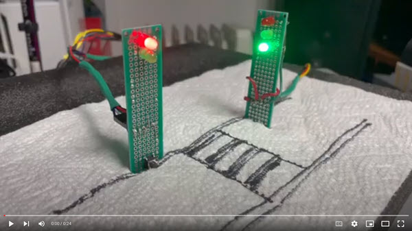

# traffic-light-teensy
Make a simple pedestrian crossing using Arduino Teensy 2.0

I had this [Arduino Teensy 2.0 board](https://www.pjrc.com/store/teensypp.html) lying around since 2013.  Finally in 2023, I decided to do soemthing with it.  Luckily, even though the hardware is not sold anymore but the libraries still work.  This project is a small simulation of a pedestrian walk signal to cross a one-way car lane.  The traffic light is green for the cars most of the time, until a pedestrian presses a button to cross.  There is a not a lot going on here. The code is somewhat based on MVC pattern (MVC minus the model.)  We know all the views or states.

1. Green light for the cars and red light for pedestrians.
2. Yellow light for the cars.
3. Red for the cars and green for pedestrians.
4. Blinking green for pedestrians (About to go red.)

In terms of controller, there is only one event.  When pedestrian pushes the button to corss, a flag is set indicating the push event.  Since the whole cycle is looping, it checks for this flag and if the flag is on, it branches to other states, otherwise the cycle continues as usual (green for cars.)

Please reach out to me, if you have any questions.

## Controller board

## Traffic lights

## In action

